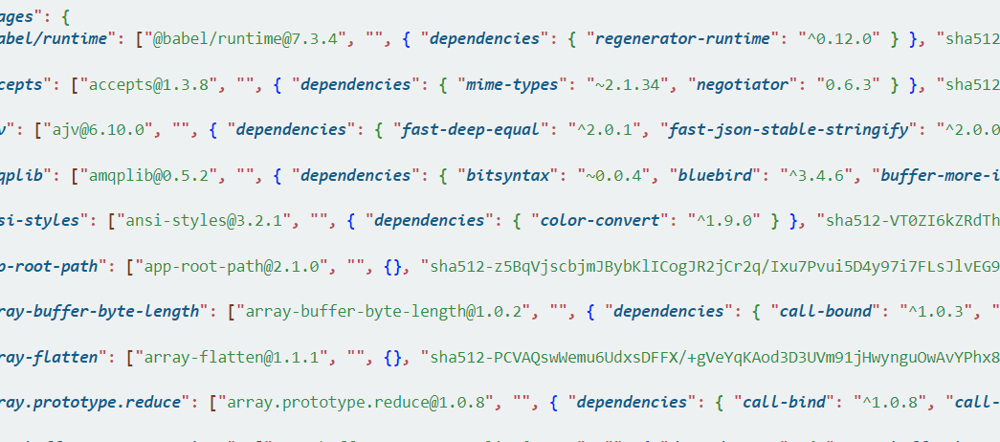
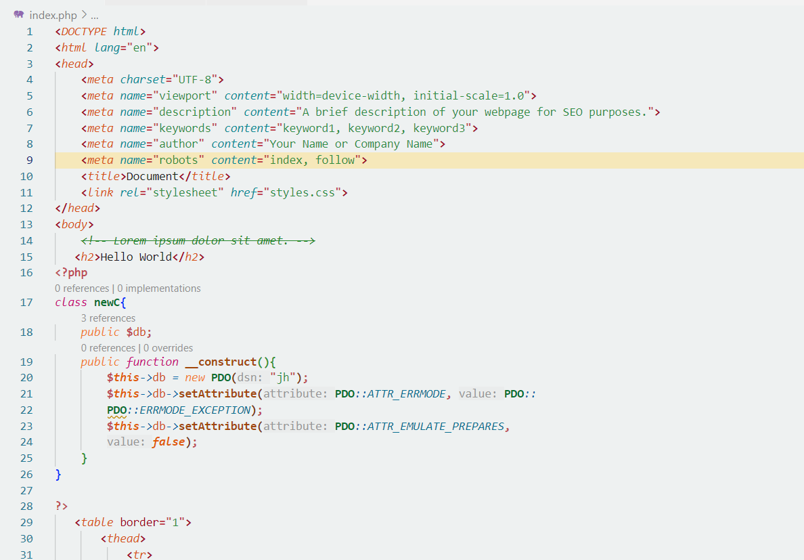

# PHPPoint Light Theme
## 🌟 Introduction
PHPPoint Light Theme is designed to provide a clean and visually appealing coding environment for PHP developers. With a focus on readability and reducing eye strain, this theme offers a soft, light background combined with carefully selected accent colors for various syntax elements.

The color palette ensures optimal contrast between text and background, making it easy to distinguish different components of the code. The soft tones for comments and the clear distinctions for keywords, variables, and functions enhance the coding experience, while providing a comfortable and efficient workspace for long coding sessions.

Whether you're debugging or writing code, the PHPPoint Light Theme is built to help you stay focused and productive while maintaining a visually soothing interface.

## 🎨 Features
✅ Soft and balanced color scheme for better focus
✅ Optimized for PHP, HTML, CSS, JavaScript, and more
✅ Lightweight and easy to install

## Screenshots

## 🚀 Release Version
### 🛠 v0.2.28032025 – Improve and bug fixed.
### 🛠 v0.0.1 – Initial release.

🔹 Enjoy coding with PHPPoint Light Theme!
